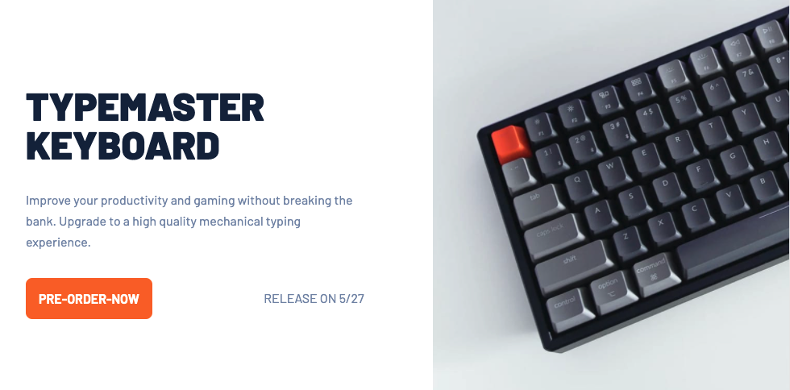

# Typemaster Landing Page

## Overview

A mobile first, fully responsive landing page for a product. Breakpoints were created to strategically compliment the content, and a combination of negative margins and absolute positioning techniques were utilized to position certain elements. 

[Live Demo](https://philosophy-flow.github.io/pod-request-landing-page/)

### Built With

  * HTML / CSS

## Acknowledgements
Special thanks to:
  * Front End Mentor for providing the design assets (figma file + images).
